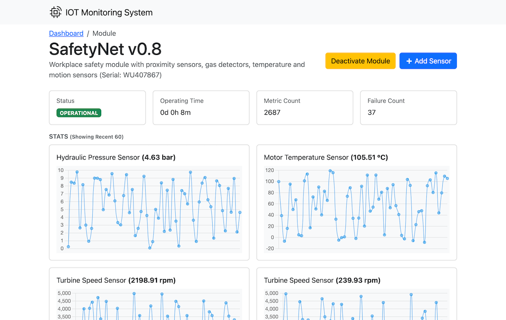

# IOT Module Monitoring System

This document provides an overview and implementation details of the IoT Module Monitoring System.

<p align="center">
  
</p>

## Requirements

- PHP 8.3
- Composer 2.7
- Node 21
- MySQL 8.0

## Getting Started

1. Clone the repository
2. Install dependencies with `composer install` and `npm install`
3. Copy `.env.example` to `.env` and update the database credentials
4. Run `php artisan key:generate` to generate an application key
5. Run `php artisan migrate --seed` to create the database schema and seed it with initial data
6. Run `composer run dev` to start server, worker, pail and vite to build assets
7. Optionally to run the module simulator, run `php artisan modules:simulate`

## Local Module Simulation

> NOTE: Current implementation of simulator keeps the loaded modules in memory to simulate data for those module. So based on your system memory, you may want to limit the number of modules to simulate. The simulation is meant for local dev and testing purposes and not for load testing. But you can technically run the simulation on production or staging env as it doesn't depend on model factories.

The simulation behavior is controlled by the `SimulationConfig` class and command options. Key configuration parameters include: `Sensor Types`, `Failure Scenarios`.

To modify simulation parameters, update the constants in `app/Simulation/SimulationConfig.php`.

To run the simulator:

```bash
# Simulate all modules with 5 second interval (default)
php artisan modules:simulate

# Simulate specific modules
php artisan modules:simulate --modules=1 --modules=2

# Change simulation interval (in seconds)
php artisan modules:simulate --interval=10

# Limit number of modules to simulate (default: 100)
php artisan modules:simulate --limit=1000

# Override failure probability percentage (default: 15%)
php artisan modules:simulate --failure=25

# Disable failures
php artisan modules:simulate --failure=0
```

The simulator will generate sensor readings and potential failures that are processed by the system's job queues. Press Ctrl+C to stop the simulation.

## Model Structure

The system uses the following models to represent and track IoT modules and their data:

### Module

The main model representing an IoT device/module with the following relationships:

- Has many `Sensor`s for collecting different types of data
- Has many `SensorReading`s tracking historical sensor values
- Has many `ModuleFailure`s recording any system failures
- Tracks operational status via `ModuleStatus` enum (Operational, Malfunction, Deactivated)
- Stores module start/stop times and calculates total operating duration

### Sensor

Represents individual sensors attached to modules:

- Belongs to a `Module`
- Has many `SensorReading`s
- Tracks sensor name, measurement unit and current value
- Common sensor types include temperature, pressure, rotation speed etc.

### SensorReading

Historical time-series data from sensors:

- Belongs to both a `Sensor` and `Module`
- Stores the measured value and timestamp
- No auto-timestamps (uses recorded_at)
- Values stored with 2 decimal precision

### ModuleFailure

Records system failures and errors:

- Belongs to a `Module`
- Stores failure timestamp, description and error code
- No auto-timestamps (uses failure_at)
- Used for tracking reliability and maintenance needs

## Bootstrap Setup

Bootstrap 5 is integrated through SCSS in [`resources/css/app.scss`](/resources/css/app.scss) with modular imports for optimized bundle size. JavaScript components are loaded via [`resources/js/bootstrap.js`](/resources/js/bootstrap.js) and styles are compiled using Vite. Refer: <https://getbootstrap.com/docs/5.3/customize/sass/>
